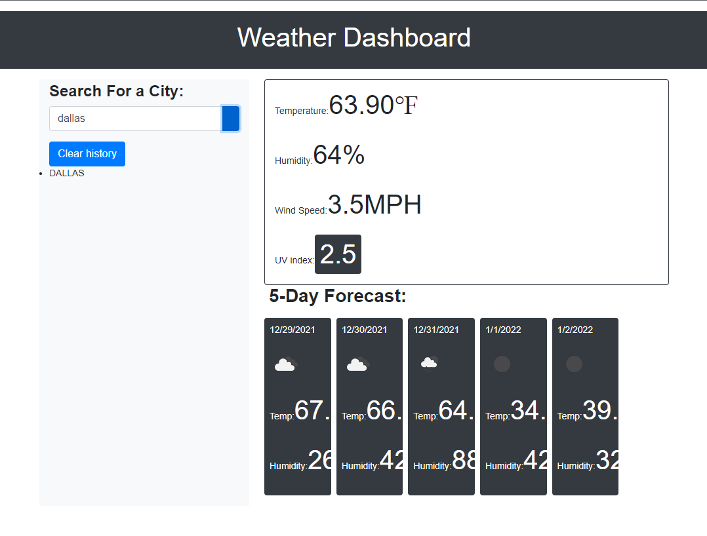

# Weather Dashboard
## This application shows you the weather using the openweather API. It includes temperature, wind speed, humidity,and uv index. 

This application was created with:
* HTML
* Bootstrap
* CSS
* Javascript

[Link](placeholder)